# Assignment-3

<center> 黎郡 2020E8017782051
</center>


> 实验环境：
>
> * Python 3.8.3
> * Opencv 4.0.1

## Question

编一个程序实现如下功能：

* 读入一幅指纹图像（自己找）
* 对图像进行二值化（方法自定，可以是阈值法）
* 采用形态学骨架提取和距离变换骨架提取两种算法分别提取图像骨架
* 采用裁剪算法，并分析其效果

## Answer

### 1.图像的二值化

观察指纹图像我们可以发现目标和背景的灰度分布非常不同，可以对整个图像使用单个阈值，即全局阈值法。估计阈值的方法采用迭代算法进行估计。迭代算法的核心思想如下：

1. 为全局阈值T选择一个初始值 (一般选用图像的均值作为初始阈值)

2. 基于阈值T分割图像。产生两组像素：灰度值大于T的像素组成G1， 灰度值小于T的像素组成G2.

3. 对G1和G2中的像素分别计算平均灰度值m1, m2

4. 在m1和m2之间计算一个新的阈值$T^{'} =\frac{1}{2}(m1+m2) $

5. 重复2—4, 直到连续迭代中的两个T值间的差小于某个预定的值$\varepsilon$,  $\varepsilon$是一个足够小的数 

   > $|T^{'}-T|< \varepsilon $

二值化代码见binary.py

```python
# 根据阈值分割的迭代法计算阈值T
def iteration_threshold(img_array):
    # 使用图像的均值作为初始阈值
    T = 0
    T_new = np.mean(img_array)
    epsilon = 1e-5
    k = 0

    while np.abs(T_new - T) >= epsilon:
        T = T_new
        G1 = []  # 灰度值大于T的像素组成G1
        G2 = []  # 灰度值小于T的像素组成G2
        for i in range(img_array.shape[0]):
            for j in range(img_array.shape[1]):
                if img_array[i, j] > T:
                    G1.append(img_array[i, j])
                else:
                    G2.append(img_array[i, j])
        T_new = 0.5 * (np.mean(G1) + np.mean(G2))
        k += 1
    return T_new, k


def Binaryzation(_img):
    # 迭代法求阈值
    _threshold, _k = iteration_threshold(_img)
    # 二值化
    img_bin = np.where(_img > _threshold, 0, 255)
    return _threshold, _k, img_bin.astype(np.uint8)
```

得到实验结果如下：

原图：

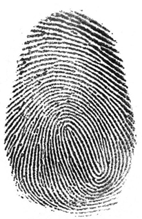

通过迭代法得到的阈值为154.466， 迭代6次之后就可以得到阈值。观察分割原图和分割结果可以发现二值化效果理想。

> threshold 154.56631011088396   k:  6
>
> 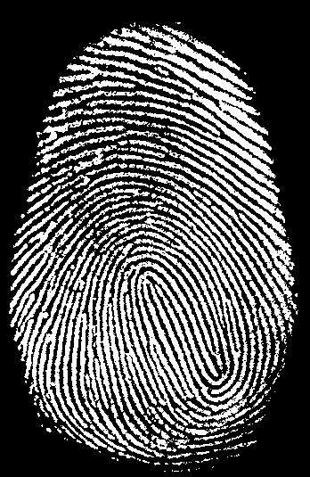

<div style="page-break-after:always"></div>

### 2.形态学基础算法实现

此次作业主要设计三个形态学中较常用的基础算法：腐蚀、膨胀和开运算

#### 2.1 腐蚀与膨胀

本次算法实现了基于位移运算的腐蚀与膨胀运算，有效的提高了运算效率。

假设结构和的形式如下：橙色部分为anchor

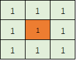

基于位移的腐蚀运算就相当于将图像分别想左上、上、右上、左、右、左下、下、右下八个方向进行平移，之后**将得到的图像取交集，就得到了腐蚀的结果。同理，膨胀即为得到图像的结果取并集。**

详细代码见basic_morphology.py

```python
# 腐蚀
def erode(_img):  # 输入的为二值图
    # 初始化图像平移矩阵
    m_1 = np.array([[1, 0, -1], [0, 1, -1]], dtype=np.float32)  # 左上
    m_2 = np.array([[1, 0, 0], [0, 1, -1]], dtype=np.float32)  # 上
    m_3 = np.array([[1, 0, 1], [0, 1, -1]], dtype=np.float32)  # 右上
    m_4 = np.array([[1, 0, -1], [0, 1, 0]], dtype=np.float32)  # 左
    m_5 = np.array([[1, 0, 1], [0, 1, 0]], dtype=np.float32)  # 右
    m_6 = np.array([[1, 0, -1], [0, 1, 1]], dtype=np.float32)  # 左下
    m_7 = np.array([[1, 0, 0], [0, 1, 1]], dtype=np.float32)  # 下
    m_8 = np.array([[1, 0, 1], [0, 1, 1]], dtype=np.float32)  # 右下
    M = [m_1, m_2, m_3, m_4, m_5, m_6, m_7, m_8]

    # 9个平移后的图像取交集得到腐蚀结果
    img_result = _img.copy()
    for i in M:
        img_shift = cv2.warpAffine(_img, i, (_img.shape[1], _img.shape[0]))  # 使用放射变化进行平移
        img_result = cv2.bitwise_and(img_result, img_shift)

    return img_result
```

```python
# 膨胀
def dilate(_img):  # 输入的为二值图
    # 初始化图像平移矩阵
    m_1 = np.array([[1, 0, -1], [0, 1, -1]], dtype=np.float32)  # 左上
    m_2 = np.array([[1, 0, 0], [0, 1, -1]], dtype=np.float32)  # 上
    m_3 = np.array([[1, 0, 1], [0, 1, -1]], dtype=np.float32)  # 右上
    m_4 = np.array([[1, 0, -1], [0, 1, 0]], dtype=np.float32)  # 左
    m_5 = np.array([[1, 0, 1], [0, 1, 0]], dtype=np.float32)  # 右
    m_6 = np.array([[1, 0, -1], [0, 1, 1]], dtype=np.float32)  # 左下
    m_7 = np.array([[1, 0, 0], [0, 1, 1]], dtype=np.float32)  # 下
    m_8 = np.array([[1, 0, 1], [0, 1, 1]], dtype=np.float32)  # 右下
    M = [m_1, m_2, m_3, m_4, m_5, m_6, m_7, m_8]

    # 9个平移后的图像取交集得到腐蚀结果
    img_result = _img.copy()
    for i in M:
        img_shift = cv2.warpAffine(_img, i, (_img.shape[1], _img.shape[0]))  # 使用放射变化进行平移
        img_result = cv2.bitwise_or(img_result, img_shift)

    return img_result
```

#### 2.2 开运算

结构元B对集合A的开运算用$A \circ B=(A \circleddash B) \oplus B$进行定义：

即开运算为：用结构元先对A进行腐蚀，接着B对腐蚀结果进行膨胀。

详细代码见basic_morphology.py

```python
# 开运算
def open_operation(_img):
    # 先腐蚀, 再膨胀
    img_result = erode(_img)
    img_result = dilate(img_result)

    return img_result
```

<div style="page-break-after:always"></div>

### 3. 骨架提取算法

#### 3.1 基于形态学的骨架提取

根据书本定义，可以知道基于形态学的骨架提取实际上是利用了腐蚀和开运算进行实现的。定义集合A的骨架为S(A):
$$
S(A)=\bigcup^{K}_{k=0}S_k(A) \tag1 \\
$$

$$
S_k(A)=(A \circleddash kB )-(A \circleddash kB ) \circ B \tag2
$$

- 式2中的$(A \circleddash kB )$表示对A的连续k次腐蚀，即

  > $(A \circleddash kB )=((...(A \circleddash B)\circleddash B\circleddash ...)\circleddash B)$

- 式1中的K是A被腐蚀为一个空集之前的最后一个迭代步骤

- 骨架S(A)是骨架子集$S_k(A), k=0,1,2,...K$的并集。

详细代码见skeleton.py

```python
def mor_skeleton(_img):  # _img: 待提取骨架图像(默认为前景为白色的二值图像)
    # 骨架图像初始化
    img_result = np.zeros_like(_img)

    # 循环提取骨架, 当腐蚀后图像无前景时停止
    while np.sum(_img):
        # 当第一次的时候k=0， 所以相当于直接开运算
        # 迭代过一次后，_img是一个已经腐蚀并做差后的图像
        img_open = open_morph(_img)
        img_sub = _img - img_open  # 求差
        img_result = cv2.bitwise_or(img_result, img_sub.copy()) # 求并生成骨架
        _img = erode(_img)  # 再进行腐蚀
    return img_result
```

实验结果如下：

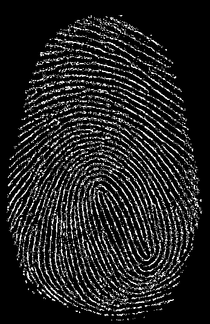

<div style="page-break-after:always"></div>

#### 3.2 基于距离变化的骨架提取

距离变化的基本思想是把离散分布在空间中的目标根据一定的距离定义方式生成距离图，其中每一点的距离值是到空间目标距离中最小的一个。在二值图中目标就是前景，即像素为255的像素。下图代表假定目标为A,B,C,D的距离变换图。

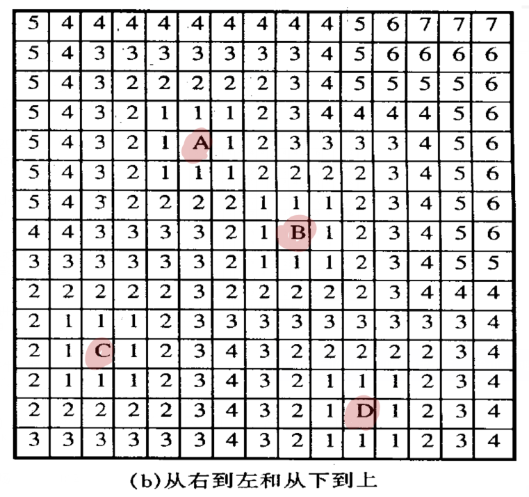

基本步骤：

1. 求取二值图像的边界

   > 原图减去一次腐蚀后的图像就可以求得边界

2. 对边界二值图求距离变化（这里直接使用opencv的distanceTransform函数实现)

   > 此处的距离为欧式距离

3. 求距离变换图中的局部极大值

   > **为了降低局部极大值计算的时间：**求取极大值时使用卷积方法实现, 构建8个卷积模板, 其作用为用中心元素像素值依次减去周围8个元素的像素值, 若某一位置得到的8个卷积结果均大于等于0, 则证明它是8邻域内的极大值。8个卷积核如下：
   > $$
   > \left\{
   >  \begin{matrix}
   >    -1 & 0 & 0 \\
   >    0 & 1 & 0 \\
   >    0 & 0 & 0
   >   \end{matrix}
   >   \right\} 
   >    \left\{
   >  \begin{matrix}
   >    0 & -1 & 0 \\
   >    0 & 1 & 0 \\
   >    0 & 0 & 0
   >   \end{matrix}
   >   \right\} 
   >    \left\{
   >  \begin{matrix}
   >    0 & 0 & -1 \\
   >    0 & 1 & 0 \\
   >    0 & 0 & 0
   >   \end{matrix}
   >   \right\} 
   >    \left\{
   >  \begin{matrix}
   >    0 & 0 & 0 \\
   >    -1 & 1 & 0 \\
   >    0 & 0 & 0
   >   \end{matrix}
   >   \right\} 
   >    \left\{
   >  \begin{matrix}
   >    0 & 0 & 0 \\
   >    0 & 1 & -1 \\
   >    0 & 0 & 0
   >   \end{matrix}
   >   \right\} 
   >    \left\{
   >  \begin{matrix}
   >    0 & 0 & 0 \\
   >    0 & 1 & 0 \\
   >    -1 & 0 & 0
   >   \end{matrix}
   >   \right\} 
   >    \left\{
   >  \begin{matrix}
   >    0 & 0 & 0 \\
   >    0 & 1 & 0 \\
   >    0 & -1 & 0
   >   \end{matrix}
   >   \right\} 
   >    \left\{
   >  \begin{matrix}
   >    0 & 0 & 0 \\
   >    0 & 1 & 0 \\
   >    0 & 0 & -1
   >   \end{matrix}
   >   \right\}
   > $$

4. 落入**原二值图像**中的局部极大值就是图像的骨架

详细代码见skeleton.py

```python
# 获得8邻域内极大值像素组成的图像
def find_max(_img):
    # 生成8个减法模板
    kmax_1 = np.array([[-1, 0, 0], [0, 1, 0], [0, 0, 0]], dtype=np.float32)
    kmax_2 = np.array([[0, -1, 0], [0, 1, 0], [0, 0, 0]], dtype=np.float32)
    kmax_3 = np.array([[0, 0, -1], [0, 1, 0], [0, 0, 0]], dtype=np.float32)
    kmax_4 = np.array([[0, 0, 0], [-1, 1, 0], [0, 0, 0]], dtype=np.float32)
    kmax_5 = np.array([[0, 0, 0], [0, 1, -1], [0, 0, 0]], dtype=np.float32)
    kmax_6 = np.array([[0, 0, 0], [0, 1, 0], [-1, 0, 0]], dtype=np.float32)
    kmax_7 = np.array([[0, 0, 0], [0, 1, 0], [0, -1, 0]], dtype=np.float32)
    kmax_8 = np.array([[0, 0, 0], [0, 1, 0], [0, 0, -1]], dtype=np.float32)
    kernel = [kmax_1, kmax_2, kmax_3, kmax_4, kmax_5, kmax_6,
              kmax_7, kmax_8]

    # 生成一个与原图大小相等像素全为255的图像
    img_result = cv2.bitwise_not(np.zeros_like(_img, dtype=np.uint8))
    # 依次进行减法模板操作, 取结果交集为极大值像素图像
    for i in kernel:
        # 减法模板滤波
        img_m = cv2.filter2D(_img, -1, i)
        # 差值非负处取为255: 操作点像素值>=被减处像素
        img_m = np.where(img_m >= 0.0, 255, 0)
        img_m = img_m.astype(np.uint8)
        # 大于等于8邻域内所有像素的点为区域极大值点
        img_result = cv2.bitwise_and(img_result, img_m)

    return img_result


# 基于距离变化的骨架提取
def distTrans_skeleton(_img):  # img: 待提取骨架图像(默认为前景为白色的二值图像)

    # 通过形态学操作获得前景边界
    img_bd = _img - erode(_img)
    # 对边界图像做距离变换
    img_distTrans = cv2.distanceTransform(
        cv2.bitwise_not(img_bd.copy()),
        cv2.DIST_L2, cv2.DIST_MASK_3)
    # 求距离变换图中的局部极大值
    img_max = find_max(img_distTrans)
    # 落入原二值图像中的局部极大值即为图像的骨架
    img_result = cv2.bitwise_and(img_max, _img)

    return img_result

```

实验结果如下：

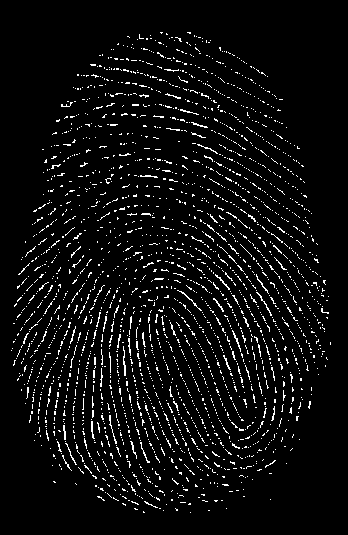

<div style="page-break-after:always"></div>

### 4. 裁剪算法

#### 4.1 击中击不中算法

形态学中的击中击不中算法是用于形态检测的基本工具，记作如下：
$$
I \circledast B_{1,2}=(A \circleddash X) \bigcap [A^c \circleddash (W-X)]\\
B_1=X,B_2=W-X
$$
击中击不中直观解释：检测特定的结构元素是否包含在图像，如果包含则保留结构元素的原点，不包含则结果图像为空。


#### 4.2 细化算法

结构元B对前景像素集合A的细化 (用$A \bigotimes B$表示) ， 可以根据击中—击不中变化来定义：
$$
A \otimes B=A-(A\circledast B)=A \bigcap (A \circledast B)^c \tag1
$$
细化过程的另一种定义是以结构元序列为基础的：
$$
\{B\}={B^1,B^2,B^3,...,B^n} \tag2
$$

$$
A \otimes \{B\}=((...((A \otimes B^1)\otimes B^2)...)\otimes B^n) \tag3
$$

A首先被$B^1$细化一次，得到的结果然后被$B^2$细化一次，以此类推直到A被$B^n$细化一次。重复整个过程，直到所有的结构元的遍历完成后结果不再出现变化为止。每次细化都是使用式子3完成。

$\{B\}$的定义如下：

注：$\times$为不关心点

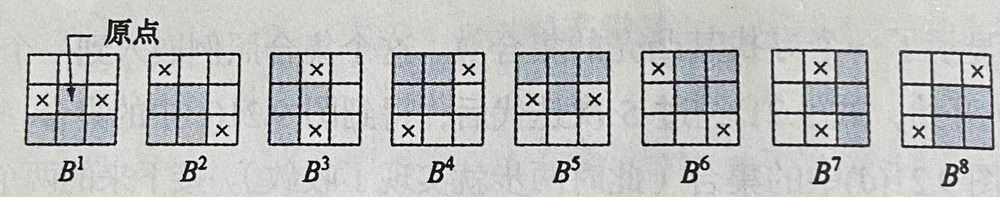

**注意为了简化运算，采用卷积的方式进行击中击不中$A \circledast B$的判断：**

> 细化中需对每个结构元进行击中击不中运算, 而击中击不中运算中包含判断这里使用卷积结果判断击中击不中, 对结构元B中的每个位置进行差异化赋值. 赋值方法如下:
>
> * 对于结构元中的击中位置, 以$2^n$赋值, 其中n为击中位置的序号(从0开始). 对于细化常用的结构元, 有四个击中区域, 则$n=0,1,2,3$, 也即分别赋值1,2,4,8.
> * 对于结构元中的击不中位置, 均赋值$2^(n+1)$.对于细化常用的结构元, 有四个击不中区域, 则$n+1=4$, 也即均赋值16.
> * 对于结构元中的不必考虑位置, 赋值为0.
>
> 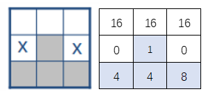
>
> 此时, 若击中, **则卷积结果为15**, 否则为击不中. 因此, 卷积后只需找到结果中等于15的位置即为击中位置, 其余位置为击不中。**(注意，要对二值图进行归一化)**

详细代码见tailor.py

```python
def thinning_algorithm(img, K):  # img: 待细化图像  K: 结构子序列
    img_result = img / 255  # 归一
    # 初始化用于保存上一次结果的矩阵
    img_old = 1 - img_result

    # 循环细化.直至图像保持不变
    while np.sum(img_result - img_old):
        img_old = img_result
        for i in K:
            # 基于卷积结果的击中击不中
            img_temp = np.where(cv2.filter2D(img_result.copy(), -1, i
                                             , borderType=0) == 15, 1, 0)
            img_result = img_result - img_temp

    img_result *= 255
    return img_result.astype(np.uint8)


def thinning(_img): # img: 待细化图像

    # 生成8个结构子序列
    k_1 = np.array([[16, 16, 16], [0, 1, 0], [2, 4, 8]], dtype=np.uint8)
    k_2 = np.array([[0, 16, 16], [1, 2, 16], [4, 8, 0]], dtype=np.uint8)
    k_3 = np.array([[1, 0, 16], [2, 4, 16], [8, 0, 16]], dtype=np.uint8)
    k_4 = np.array([[1, 2, 0], [4, 8, 16], [0, 16, 16]], dtype=np.uint8)
    k_5 = np.array([[1, 2, 4], [0, 8, 0], [16, 16, 16]], dtype=np.uint8)
    k_6 = np.array([[0, 1, 2], [16, 4, 8], [16, 16, 0]], dtype=np.uint8)
    k_7 = np.array([[16, 0, 1], [16, 2, 4], [16, 0, 8]], dtype=np.uint8)
    k_8 = np.array([[16, 16, 0], [16, 1, 2], [0, 4, 8]], dtype=np.uint8)

    K = [k_1, k_2, k_3, k_4, k_5, k_6, k_7, k_8]

    # 细化操作
    img_result = thinning_algorithm(_img, K)

    return img_result
```

细化结果如下：

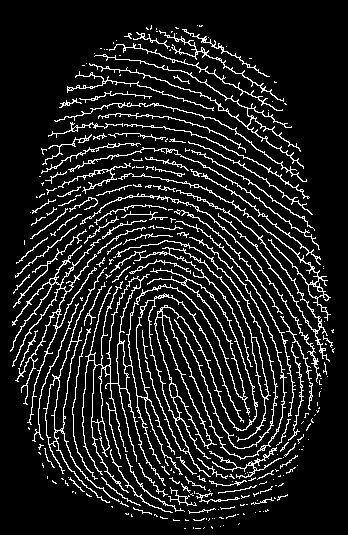

<div style="page-break-after:always"></div>

#### 4.3 剪裁算法

裁剪的目的是清除细化和骨架算法产生的一些不必要的附加成分。

剪裁算法的过程：

1. 用一系列被设计用来检测终点的结构元素对A进行细化。

   > $X_1=A\otimes \{B\}$
   >
   > $\{B\}$为结构元素序列，每种结构元素都邻域的8个像素旋转90度。
   >
   > 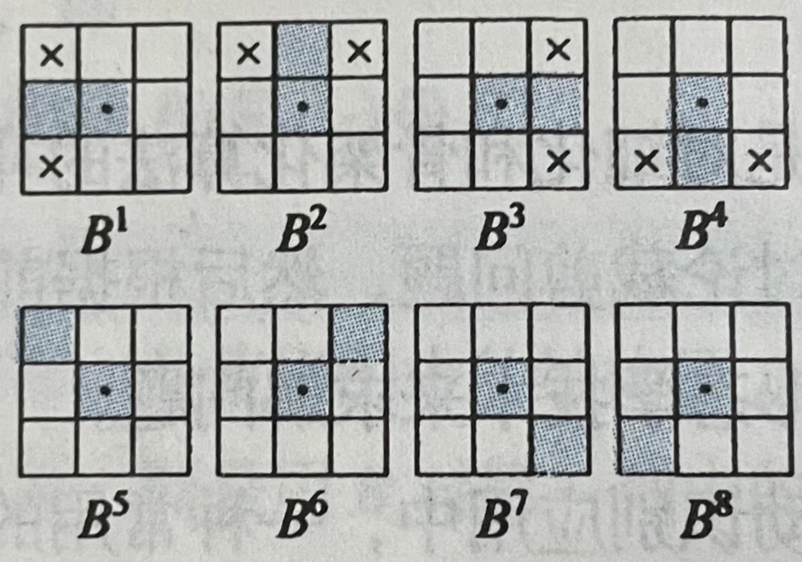

2. 得到建立在X1中，包含(用击中击不中判断)的所有终点的集合X2。

   > $$
   > x_2=\bigcup^{8}_{k=1}(X_1 \circledast B^k)
   > $$

   > 这里的击中击不中同样可以利用卷积进行判断：
   >
   > 如果卷积结果为3则击中

3. 膨胀端点。对端点进行3次膨胀，用A作为消减因子。

   > $$
   > X_3=(X_2 \oplus H)\cap A
   > $$
   >
   > $H$是元素值为1的$3\times3$的结构元

4. X3和X1的并集即为所求

   > $X_4=X_4 \cup X_1$

详细代码见tailor.py

```python
#  找到端节点
def find_end(_img, K):  # _img: 输入图像 K: 结构子序列
    # 像素归一化
    img_ones = _img / 255
    img_result = np.zeros_like(_img, dtype=np.uint8)

    # 利用结构子序列寻找端点
    for i in K:
        img_temp = np.where(cv2.filter2D(img_ones.copy(), -1, i,
                                         borderType=0) == 3, 1, 0)
        img_result = img_result + img_temp

    img_result *= 255
    # 返回只有端节点为前景的图像
    return img_result.astype(np.uint8)


def tailor(_img):  # _img: 待裁剪图像

    # 生成8个结构子
    k_1 = np.array([[0, 4, 4], [1, 2, 4], [0, 4, 4]], dtype=np.uint8)
    k_2 = np.array([[0, 1, 0], [4, 2, 4], [4, 4, 4]], dtype=np.uint8)
    k_3 = np.array([[4, 4, 0], [4, 1, 2], [4, 4, 0]], dtype=np.uint8)
    k_4 = np.array([[4, 4, 4], [4, 1, 4], [0, 2, 0]], dtype=np.uint8)
    k_5 = np.array([[1, 4, 4], [4, 2, 4], [4, 4, 4]], dtype=np.uint8)
    k_6 = np.array([[4, 4, 1], [4, 2, 4], [4, 4, 4]], dtype=np.uint8)
    k_7 = np.array([[4, 4, 4], [4, 1, 4], [4, 4, 2]], dtype=np.uint8)
    k_8 = np.array([[4, 4, 4], [4, 1, 4], [2, 4, 4]], dtype=np.uint8)

    K = [k_1, k_2, k_3, k_4, k_5, k_6, k_7, k_8]

    # 细化(去除3个像素组成的分支)
    img_thin = thinning_algorithm(_img, K)
    # 找端点
    img_end = find_end(img_thin, K)
    # 膨胀运算,捡回误伤元素
    img_dilate = img_end
    for _ in range(3):
        img_dilate = dilate(img_dilate)
        img_dilate = cv2.bitwise_and(img_dilate, _img)
    # 获得裁剪结果
    img_result = cv2.bitwise_or(img_dilate, img_thin)

    return img_result

```

裁剪结果如下：

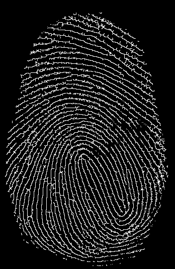

<div style="page-break-after:always"></div>

### 5.实验结果

#### 5.1主函数代码

代码见main.py

```python
import cv2
import numpy as np

from binary import Binaryzation
from skeleton import mor_skeleton
from skeleton import distTrans_skeleton
from tailor import thinning
from tailor import tailor


def main(img):

    # 二值化: 基于迭代法获取二值化阈值
    print("Processing: 二值化...")
    threshold, k, img_bin = Binaryzation(np.array(img))

    print("阈值:", threshold)
    cv2.imwrite("./result/img_binary.png", img_bin)

    # 基于形态学的骨架提取./result/
    print("Processing: 基于形态学的骨架提取...")
    img_sk_morph = mor_skeleton(img_bin)
    cv2.imwrite("./result/morph_skeleton.png", img_sk_morph)

    # 基于距离变换的骨架提取
    print("Processing: 基于距离变换的骨架提取...")
    img_sk_dist = distTrans_skeleton(img_bin)
    cv2.imwrite("./result/distTrain_skeleton.png", img_sk_dist)

    # 图像细化
    print("Processing: 图像细化...")
    img_sk_thin = thinning(img_bin)
    cv2.imwrite("./result/thinning.png", img_sk_thin)

    # 裁剪:以细化所得骨架为例
    print("Processing: 裁剪:以细化所得为例...")
    img_result = tailor(img_sk_thin)
    cv2.imwrite("./result/tailor.png", img_result)


if __name__ == "__main__":
    img = cv2.imread("./img/fingerprint.jpg", 0)
    main(img)
```

#### 5.2 实验结果

所有实验结果均在./result/文件夹下

