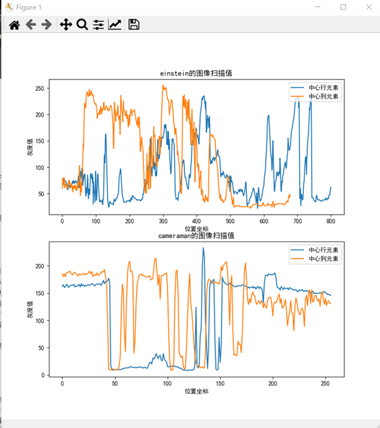
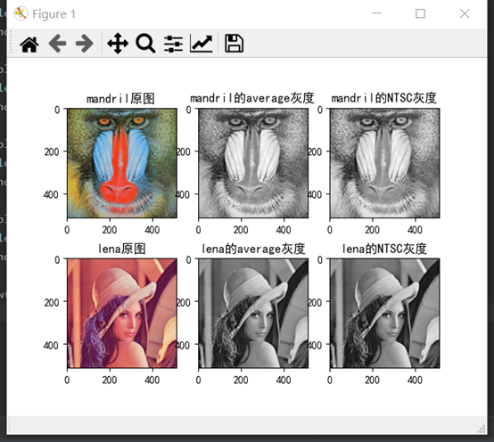
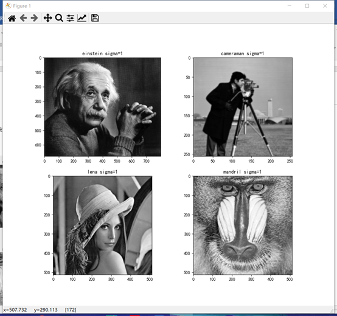
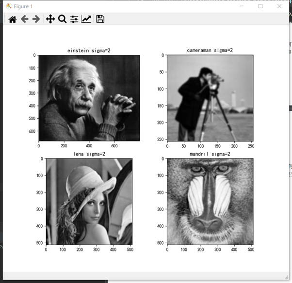
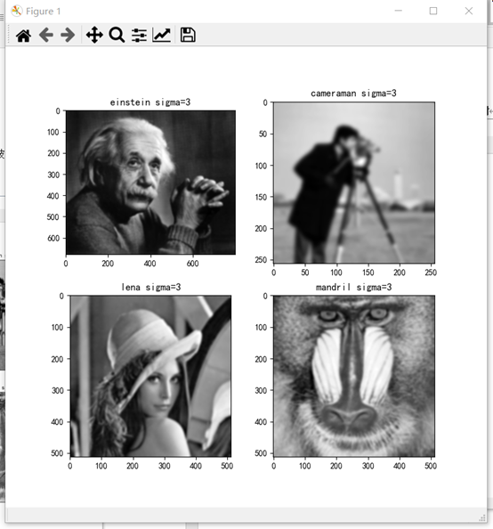
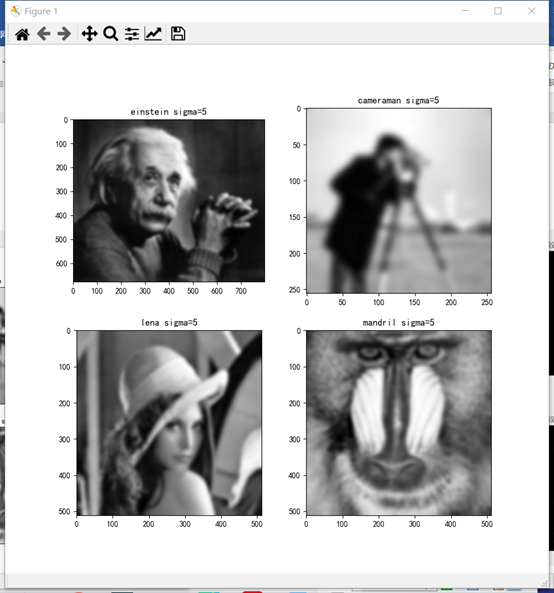
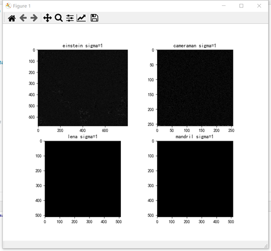
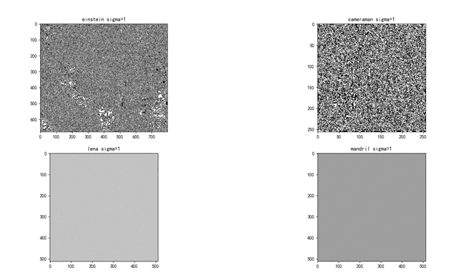
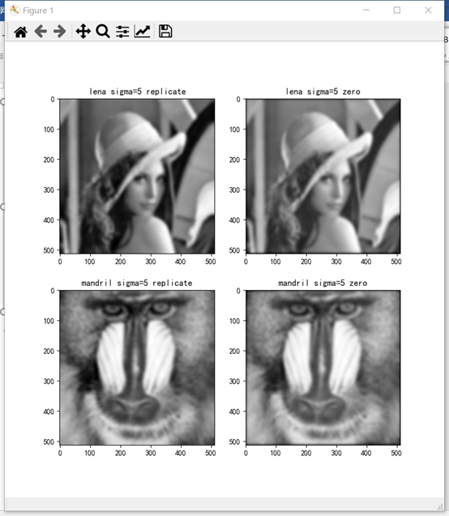

# 图像处理与分析 作业一

黎郡 2020E8017782051

## 安装依赖

- python3.8
- opencv 4.0.1
- numpy 1.18.5
- pillow 7.2.0
- matplotlib 3.2.2

## 问题1：黑白图像灰度扫描

实现一个函数 s = scanLine4e(f, I, loc), 其中 f 是一个灰度图像，I 是一个整数，loc 是一个字 符串。当 loc 为’row’时，I 代表行数。当 loc 为’column’时，I 代表列数。输出 s 是对应的相 关行或者列的像素灰度矢量。 调用该函数，提取 cameraman.tif 和 einstein.tif 的中心行和中心列的像素灰度矢量并将扫描 得到的灰度序列绘制成图。

### 实验结果

运行文件“question1.py”即可。

结果如图：



## 问题2：彩色图像转换为黑白图像

图像处理中的一个常见问题是将彩色 RGB 图像转换成单色灰度图像，第一种常用的方法是 取三个元素 R，G，B 的均值。第二种常用的方式，又称为 NTSC 标准，考虑了人类的彩色 感知体验，对于 R,G,B 三通道分别采用了不同的加权系数，分别是 R 通道 0.2989，G 通道 0.5870，B 通道 0.1140. 实现一个函数 g = rgb1gray(f, method). 函数功能是将一幅 24 位的 RGB 图像, f, 转换成灰度图像, g. 参数 method 是一个字符串，当其值为’average’ 时，采用 第一种转换方法，当其值为’NTSC’时，采用第二种转换方法。将’NTSC’做为缺省方式。 调用该函数，将提供的图像 mandril_color.tif 和 lena512color.tiff 用上述两种方法转换成单色 灰度图像，对于两种方法的结果进行简短比较和讨论。

### 实验结果

运行文件“question2.py”即可。

结果如图：

观察发现average方式与NTSC得到的灰度图差异并不是特别大，但NTSC方法得到的灰度图图像细节更为清晰，质感更好。



## 问题3：图像二维卷积函数

实现一个函数 g = twodConv(f, w), 其中 f 是一个灰度源图像，w 是一个矩形卷积核。要求输 出图像 g 与源图像 f 大小（也就是像素的行数和列数）一致。请注意，为满足这一要求，对 于源图像f需要进行边界像素填补(padding)。这里请实现两种方案。第一种方案是像素复制， 对应的选项定义为’replicate’，填补的像素拷贝与其最近的图像边界像素灰度。第二种方案是 补零，对应的选项定义为’zero’, 填补的像素灰度为 0. 将第二种方案设置为缺省选择。

### 实验结果

代码详见gaussBlur.py中的 twodConv(f, w)函数

## 问题4：归一化二维高斯滤波核函数

实现一个高斯滤波核函数 w = gaussKernel(sig，m)，其中 sig 对应于高斯函数定义中的σ,w 的大小为 m×m。请注意，这里如果 m 没有提供，需要进行计算确定。如果 m 已提供但过小， 应给出警告信息提示。w 要求归一化，即全部元素加起来和为 1。

### 实验结果

代码详见gaussBlur.py中的 gaussKernel(sig，m)函数

## 问题5：灰度图像的高斯滤波

调用上面实现的函数，对于问题 1 和 2 中的灰度图像（cameraman, einstein, 以及 lena512color 和 mandril_color 对应的 NTSC 转换后的灰度图像）进行高斯滤波，采用σ=1，2，3，5。任 选一种像素填补方案。 对于σ=1 下的结果，与直接调用相关函数的结果进行比较（可以简单计算差值图像）。然后， 任选两幅图像，比较其他参数条件不变的情况下像素复制和补零下滤波结果在边界上的差 别。

### 实验结果

#### 1.分别选用sigma=1,2,3,5，padding方式为replicate来进行滤波。效果如下：

运行脚本文件“question3to5.py”即可。

该问详细代码过程见question3to5.py中的changeSigmaTest()函数。

**sigma = 1**



**sigma=2**



**sigma=3**



**sigma=5**



#### 2.Sigma=1的情况下比较自写函数与库函数滤波结果：

运行脚本文件“question3to5.py”即可。

该问详细代码过程见question3to5.py中的CompareWithOfficial()函数。

【注意】由于图像本身的格式为uint8，所以不宜直接相减，需要进行类型转化

- 在进行相减的过程中应该先将图像元素类型转为int32
- 然后相减完再转回uint8进行显示

```python
r1 = np.array(result1).astype(np.int32)  # 需要先进行类型转化，不然相减会出现0-255边界问题
b1 = np.array(blur1).astype(np.int32)
diff1 = abs(r1 - b1).astype(np.uint8)
```



如果不进行类型转化，直接相减结果如下：



**结论：**

通过观察可以发现，自写函数和调用OpenCV中的库函数实现结果差异并不大。


#### 3.选择lena和mandril图像，在sigma=5的情况下比较像素复制和补零下滤波结果的差别

运行脚本文件“question3to5.py”即可。

该问详细代码过程见question3to5.py中的CompareTwoPadding()函数。

实验结果如下：

观察结果可以发现，采用‘zero'作为填充时，周围会出现黑边，且sigma越大，黑边越明显！而采用’replicate‘方式时，则不会出现黑边问题。

