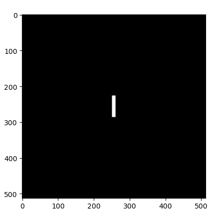
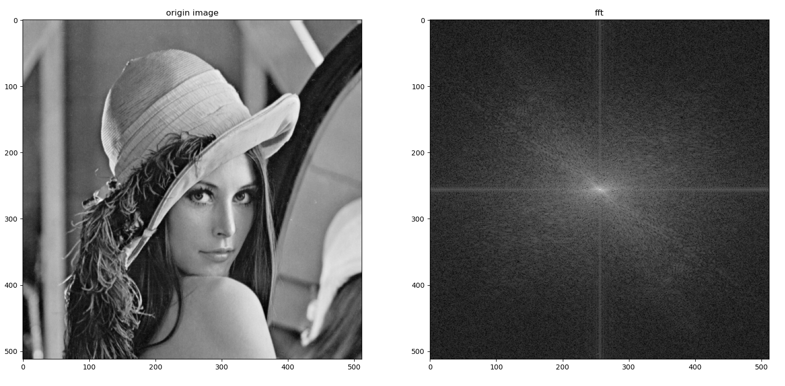

# Assignment 2

<center> 黎郡		2020E8017782051 </center>

## 安装依赖

- python3.8
- opencv 4.0.1
- numpy 1.18.5
- pillow 7.2.0
- matplotlib 3.2.2

## Question 1

 通过计算一维傅里叶变换实现图像二维快速傅里叶变换

### Answer 1

#### 二位傅里叶变化理论即证明过程

二维离散的傅里叶变化公式如下：
$$
F(u, v) =\sum_{x=0}^{M-1} \sum_{y=0}^{N-1} f(x, y) \cdot e^{-j 2 \pi\left(\frac{u x}{M}+\frac{v y}{N}\right)}
$$
二维DFT的可分离性证明如下：
$$
\begin{aligned}
&\begin{aligned}
F(u, v) &=\sum_{x=0}^{M-1} \sum_{y=0}^{N-1} f(x, y) \cdot e^{-j 2 \pi\left(\frac{u x}{M}+\frac{v y}{N}\right)} \\
&=\sum_{x=0}^{M-1}\left[\sum_{y=0}^{N-1} f(x, y) \cdot e^{-j 2 \pi \frac{vy}{N}}\right] \cdot e^{-j 2 \pi \frac{\mu x}{M}} \\
&=\sum_{x=0}^{M-1} F(x, v) \cdot e^{-j 2 \pi \frac{u \pi}{M}}
\end{aligned}\\
&\text { 其中: }\\
&\left\{\begin{array}{l}
F(x, v)=\sum_{y=0}^{N-1} f(x, y) \cdot e^{-j 2 \pi \frac{y}{N}} \sim y \text { 方向的 } D F T \\
F(u, v)=\sum_{x=0}^{M-1} F(x, v) \cdot e^{-j 2 \pi \frac{u x}{M}} \sim x \text { 方向的 } D F T
\end{array}\right.
\end{aligned}
$$
​	根据上述证明我们可以知道，二维得离散傅里叶变化可以分离为两轮一维得离散傅里叶变化。先对图像的行做一次一维得傅里叶变化，再将所得结果对列做一次一维得傅里叶变化。

​	通过调用两次一维的Fast Fourier Transformation，即可实现图像的二位快速傅里叶变化。(本代码中使用numpy中的fft实现)

```python
def dft2D(f):
    try:  # f 是一个灰度源图像
        rows, cols = f.shape
        g = np.zeros([rows, cols], dtype=complex)
        for i in range(rows):  # 先对行做一次FFT
            g[i, :] = np.fft.fft(f[i, :])
        for j in range(cols):  # 再对列做一次FFT
            g[:, j] = np.fft.fft(g[:, j])
        return g
    except ValueError:
        print("Input Error!")
```

#### 傅里叶变化可视化

运行question1.py脚本，部分代码内容如下：

```python
img = cv2.imread('rose512.tif', 0)
img_array = np.array(img)
img_norm = normalization(img_array)

# 使用傅里叶变化和中心傅里叶变化两种情况
img_dft = dft2D(img_norm)
img_center_dft = center_fft(img_norm)

# 使用slog函数更好的可视化
img_dft_slog = fft_slog(img_dft)
img_center_slog =  fft_slog(img_center_dft)

print("dft2d:")
print(img_dft.real.max(), img_dft.real.min())
print(img_dft_slog.max(), img_dft_slog.min())
print("fft_centering:")
print(img_center_dft.real.max(), img_center_dft.real.min())
print(img_center_slog.max(), img_center_slog.min())

plt.imshow(img_dft_slog, cmap='gray')
plt.imshow(img_center_slog, cmap='gray')
plt.show()
```

观测dft2D生成的傅里叶变化后的图发现是全黑的，通过打印图像的实部的最大值最小值我们发现它的范围为四千多到负两千多，无法直观的可视化。此时我们可以考虑题目四中的谱图像S=log(1+abs(F))函数，来更好的可视化图像。


经过fft_slog之后，进行傅里叶变化后的图像可以很好的可视化，不过信息大多集中在二维图像的边角位。fft_slog函数实现如下：

```python
def fft_slog(g):
    S = np.log(1 + abs(g))
    return S
```


此时的图像最大最小值范围变成了0-10左右：


为了进一步更好的可视化，将边角的信息集中在中间，我们可以用第四问的中心化傅里叶函数进行傅里叶变化，然后再使用sslog函数更好可视化，得到结果如图：


## Question 2

 图像二维快速傅里叶逆变换 

### Answer 2

#### 二位傅里叶反变化理论即证明过程

一个图像尺寸为 $M \times N$ 的函数 $f(x, y)$ 的离散傅立叶变换 $F(u, v)$ :
$$
F(u, v)=\sum_{x=0}^{M-1} \sum_{y=0}^{N-1} f(x, y) e^{-j 2 \pi(u x / M+v y / N)}
$$
$F(u, v)$ 的反变换：
$$
f(x, y)=\frac{1}{M N} \sum_{u=0}^{M-1} \sum_{v=0}^{N-1} F(u, v) e^{j 2 \pi(u x / M+v y / N)}
$$
将反变化公式$f(x, y)$进行如下变化：
$$
f(x, y)=\frac{1}{M N} \sum_{u=0}^{M-1} \sum_{v=0}^{N-1} F(u, v) e^{j 2 \pi(u x / M+v y / N)}\\
此时如果将上式两边同时取共轭则：\\
f^{*}(x, y)=\frac{1}{M N}\sum_{u=0}^{M-1} \sum_{v=0}^{N-1} F^{*}(u, v) e^{-j 2 \pi(u x / M+v y / N)}\\
其中：f^{*}(x, y)和F^{*}(u, v)分别为f(x, y)和F(u, v)的共轭函数
$$
观察等式右边$\sum_{u=0}^{M-1} \sum_{v=0}^{N-1} F^{*}(u, v) e^{-j 2 \pi(u x / M+v y / N)}$可以发现傅里叶反变化的共轭即$f^{*}(x, y)$等于对$F^{*}(u, v)$进行傅里叶变化，则要求$f(x, y)$只需要对$f^{*}(x, y)=\frac{1}{M N}\sum_{u=0}^{M-1} \sum_{v=0}^{N-1} F^{*}(u, v) e^{-j 2 \pi(u x / M+v y / N)}$求共轭即可。

```python
def idft2D(g):
    try:  # 其中 g 是一个灰度图像的傅里叶变换
        rows, cols = g.shape
        f = dft2D(g.conjugate())  # 对g的共轭求傅里叶变化
        f = f.conjugate() / (rows * cols)  # 然后再对结果求共轭并除mn即rows*cols
        return f
    except ValueError:
        print("Input Error!")
```

## Question 3

对于给定的输入图像 rose512.tif, **首先将其灰度范围通过归一化调整到[0,1]**. 将此归一化的图像记为 f. 首先调用问题 1 下实现的函数 **dft2D 计算其傅里叶变换**，记为 F。然后调用问题 2 下的函数 **idft2D 计算 F 的傅里叶逆变换**，记为 g. 计算并显示误差图像 **d = f-g**. 

### Answer 3

图像的灰度值为0-255，所以只需要将像素值统一除上最大值255即可将灰度值归一化调整到[0, 1], 则归一化后的图像f可以通过如下代码获取：

```python
def normalization(f):
    f = f / f.max()
    return f
```

#### 实验结果：

d = f-g，即归一化后的图像与傅里叶逆变话后得到的图像做差值

部分代码：

```python
img = cv2.imread('rose512.tif', 0)
img_array = np.array(img)
img_norm = normalization(img_array)

img_dft = dft2D(img_norm)
img_dft_idft = idft2D(img_dft)
diff = img_norm - img_dft_idft.real

plt.imshow(diff, cmap='gray')
plt.show()
```

- 运行question.py即可获得


## Question 4

 计算图像的中心化二维快速傅里叶变换与谱图像 。**首先合成矩形物体图像**，建议图像尺寸为 512×512，矩形位于图像中心，建议尺寸为 60 像素长，10 像素宽，灰度假设已归一化设为 1. 对于输入 **图像 f 计算其中心化二维傅里叶变换 F**。然后计算对应的**谱图像 S=log(1+abs(F)). 显示该谱图像。**

### Answer 4

#### 1. 合成矩形物体图像

- 首先利用np.zeros创建一个$512\times 512$的全零矩阵
- 然后计算中心位置为(256, 256)
- 利用切片性质将矩形范围大小置1
- 利用fromarray函数将ndarray转化为图像

```python
img_array = np.zeros((512, 512), dtype=complex)
img_array[256-30:256+30, 256-5:256+5] = 1
img = Image.fromarray(img_array.real)
```



#### 2. 计算图像的中心化二位傅里叶变化F

图2像频谱的中心化：

直接对数字图像进行二维DFT变换得到的**频谱图是高频在中间，低频在四角**，为了把能量集中起来便于使用滤波器，可以利用二维DFT的**平移性质**对频谱进行中心化。

二维傅里叶变化的平移性质定义如下：

以 $\Leftrightarrow$ 表示函数和其傅里叶变换的对应性
$$
f(x, y) e^{j 2 \pi\left(u_{0} x / M+v_{0} y / N\right)} \Leftrightarrow F\left(u-u_{0}, v-v_{0}\right) \tag{1}
$$

$$
f\left(x-x_{0}, y-y_{0}\right) \Leftrightarrow F(u, v) e^{-j 2 \pi\left(u x_{0} / M+v y_{0} / N\right)} \tag{2}
$$
公式 (1) 表明将傅里叶反变化 $f(x, y)$ 与一个指数项相乘就相当于把其傅里叶变换后的频域中心移动到新的位置
公式 (2) 表明将傅里叶变化F $(\mathrm{u}, \mathrm{v})$ 与一个指数项相乘就相当于把其傅里叶反变换后的空域中心移动到新的位置
公式（2）表明对傅里叶反变化f(x,y)的平移不影响其傅里叶变换的幅值

证明：

（1）频域移位
$$
\begin{array}{l}
D F T\left[f(x, y) \cdot e^{j 2 \pi\left(\frac{u_{0} x}{M}+\frac{v_{0} y}{N}\right)}\right] \\
=\sum_{x=0}^{M-1} \sum_{y=0}^{N-1} f(x, y) \cdot e^{j 2 \pi\left(\frac{u_{0} x}{M}+\frac{v_{0} y}{N}\right)} \cdot e^{-j 2 \pi\left(\frac{u x}{M}+\frac{v y}{N}\right)} \\
=\sum_{x=0}^{M-1} \sum_{y=0}^{N-1} f(x, y) \cdot e^{-j 2 \pi\left(\frac{\left(u-u_{0}\right) x}{M}+\frac{\left(v-v_{0}\right) y}{N}\right)} \\
=F\left(u-u_{0}, v-v_{0}\right)
\end{array}
$$
结论:
$$
f(x, y) \cdot e^{j 2 \pi\left(\frac{u_{0} x}{M}+\frac{v_{0} y}{N}\right)} \leftrightarrow F\left(u-u_{0}, v-v_{0}\right)
$$
当 $u_{0}=\frac{M}{2}, v_{0}=\frac{N}{2}$
$$
e^{j 2 \pi\left(u_{0} x / M+v_{0} y / N\right)}=e^{j \pi(x+y)}=(-1)^{x+y}
$$
$$
即： f(x, y) \cdot(-1)^{x+y} \Leftrightarrow F\left(u-\frac{M}{2}, v-\frac{N}{2}\right)​
$$

即如果需要将频域的坐标原点从从图像的起始点（0，0）移到图像的中心，则只需要将其反变化$f(x, y) \cdot(-1)^{x+y}$然后再进行傅里叶变化即可。

**实验结果：**

中心化部分代码：

```python
def center_fft(f):
    m, n = f.shape
    f_shift = normalization(f)
    for i in range(m):
        for j in range(n):
            f_shift[i, j] = f_shift[i, j] * np.power(-1, i + j)
    g = dft2D(f_shift)
    return g
```


如果不使用中心化的结果为：


#### 2. 计算谱图像

在对第一题中的rose512.tif进行可视化的时候我们就会发现图像的频域变化结果数值变化差异较大，无法很好对图像进行可视化，因此可以通过对结果取对数，来讲数值调整到一定可取的范围。根据题目，变换函数如下：
$$
S=log(1+abs(F))
$$

#### 3. 实验结果

先调用中心化傅里叶变化center_fft()函数，再使用slog函数


可以发现通过谱函数后图像细节增强，更有利于观察频域内的图像特性。

## Question 5

计算其他 5 幅图像的二维快速傅里叶变换：house.tif, house02.tif, lena_gray_512.tif, lunar_surface.tif, characters_test_pattern.tif。注意，有些图像的尺寸不是 2 的整数次幂，需要进行相应的像素填补处理。如果图像有多个通道可以选择其中的一个通道进行计算。 

### Answer 5

输出这五幅图的大小我们可以发现第二、四、五张图的大小并不是2的整数次幂：


因此我们通过CheckIfPowerOfTwoAndPadding（）函数进行检查，如果不是2的整数次幂的话就取大于该数最近的2的整数次幂大小。CheckIfPowerOfTwoAndPadding函数实现过程如下：(其中补全为补零操作)

```python
def CheckIfPowerOfTwoAndPadding(img):
    h = img.shape[0]
    w = img.shape[1]
    h_new = 0
    w_new = 0
    if not (h & (h - 1) == 0) and h != 0:
        h_new = np.power(2, int(np.log2(h) + 1))
    else:
        h_new = h
    if not (w & (w - 1) == 0) and w != 0:
        w_new = np.power(2, int(np.log2(w) + 1))
    else:
        w_new = w

    dif_h = int((h_new - h)/2)
    dif_w = int((w_new - w)/2)
    new_img = np.zeros((h_new, w_new))
    new_img[dif_h:dif_h+h, dif_w:dif_w+w] = img.copy().astype(np.int)
   
    return new_img
```

最后所有结果图如下：





